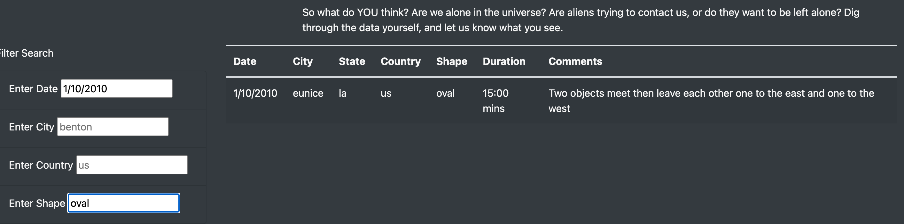

# UFOs

## Overvie
The purpose of this analysis is to create a dynamic website that shares information on UFO sightings.  The users of the webpage will be able to filter through a table for UFO sightings by date, shape, country, and city.

## Results

The interactive feature of this webpage is the ability to filter through the dynamic table.  The webpage was written to provide four filtering options: by date, city, country, and shape.  The user of the webpage and type in their criteria in the input boxes and the table will filter based on the criteria entered. 
  

 
The code was written to listen for a change on the input boxes, which enables the dynamic table to filter based on user input.  In the image below, a user is filtered for the date 1/10/2010 and the shape oval.  The resulting table row is the row that matches this criteria.
 

## Summary
This analysis is a great start for building a dynamic webpage that allows for user interaction.  This analysis can be built upon to make it more efficient in the future.  One drawback of this webpage is that the large amount of table data is displayed all at once on the webpage, making it extremely long and crowded.  Additionally, users must know what data is available for filtering the table.  A recommendation to enhace this is to create more pages of the webpage, so data can be split up.  Another recommendaton is to design the filter section to give the users the option to what they can filter the table by.